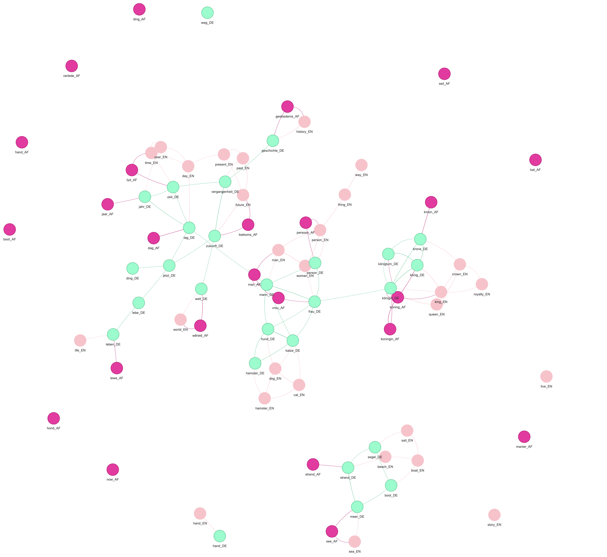

# Multilingual Word Vectors
This is a project where we visualise words from different languages using [fastText](https://fasttext.cc/)'s [aligned word vectors](https://github.com/facebookresearch/fastText/blob/master/docs/aligned-vectors.md) for different languages (Afrikaans, English and German for now).

# How it works
Using the above aligned word vectors (meaning that words from different languages map to the same vector space), we display some words graphically, and indicate connection between words that have a high cosine similarity.
# Get Started
If you only want to see this in action, or play around with the visualisation,then simply clone the repository and then open up `web/index.html`. 
If you want to use different words or different languages, then do the following:
- Download your desired language's .vec files [here](https://github.com/facebookresearch/fastText/blob/master/docs/aligned-vectors.md) to a folder `~/Downloads`, or change the folder path in `main.py:22`.
- In `src/main.py`, edit the code to add in some words lists by editing the `all_words` dictionary.
- Then run `cd src && python main.py` 
- Then simply open up `web/index.html`

# Demo
There is a demo [here](https://8onitsside.com/demo/word_vectors/).
# Sources
- [fastText](https://github.com/facebookresearch/fastText) for the word vectors
- [fastText_multilingual](https://github.com/babylonhealth/fastText_multilingual) for some ideas on aligned word vectors
- [Vis-Network](https://github.com/visjs/vis-network) to display the graph